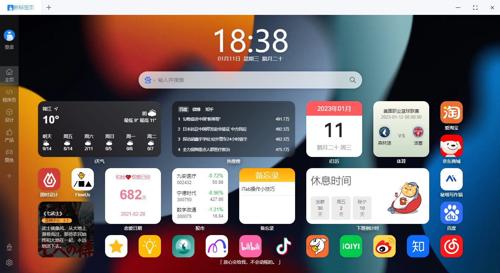
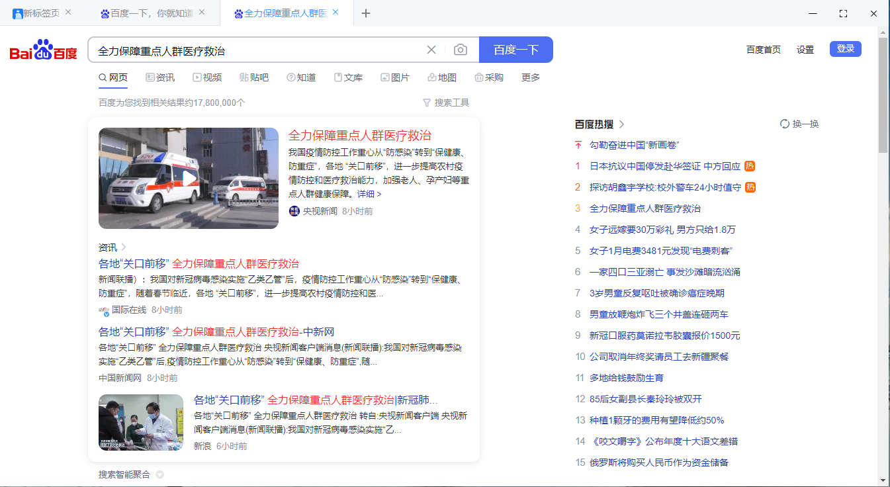

<!--
 * @Descripttion: 
 * @Author: zhangchong zc16607@gmail.com
 * @Date: 2023-05-22 16:05:04
 * @LastEditors: zhangchong zc16607@gmail.com
 * @LastEditTime: 2023-05-22 16:57:54
-->
# electron-client

electron多tab页面桌面客户端，多tab的实现是基于开源项目[神户座kobe](https://gitee.com/ArvinZJC/Kobe)，本项目主要是换了一套tab的UI，使用vue3.2.45 + element-plus2.2.28 + vue_cli + vue-cli-plugin-electron-builder插件进行打包。修复了一点原项目的bug，目前测试多tab运行正常。

如果你的项目是vue + element技术栈，本项目也可以作为一些pc前端项目转为electron客户端的简单框架，如果只是客户端嵌网页，直接改配置文件即可。如果要开发页面的话，那还需要做很多工作。

项目没啥问题，后续应该不会再更新

#### 20230522更新
1.依赖包升级到当前最新版本，主要是升级了vue-cli,eslint
2.新增了postcss 8, autoprefix, tailwindcss
主要的升级包如下
> *vue                        3.2.45 -> **3.3.4***
> *element-plus               2.2.8  -> **2.3.4***
> *@vue/cli-service           4.5.12 -> **5.0.8***
> *eslint                     6.7.2  -> **8.41.0***
> *@babel/core                          **7.21.8***
> *@babel/eslint-parser                 **7.21.8***
> *postcss                              **8.4.23***
> *autoprefixer                         **10.4.14***
> *tailwindcss                          **3.3.2***


## 预览图
启动页面



多tab展示


### 安装依赖
```
npm install
```

### 本地运行 
```
npm run electron:serve
```

### 打包
```
npm run electron:build
```

### vue配置
见 [配置连接](https://cli.vuejs.org/config/).

### electron开发文档
见 [开发文档](https://cli.vuejs.org/config/).

### 客户端打包相关配置
见 [打包相关配置](https://www.electron.build/configuration/configuration).